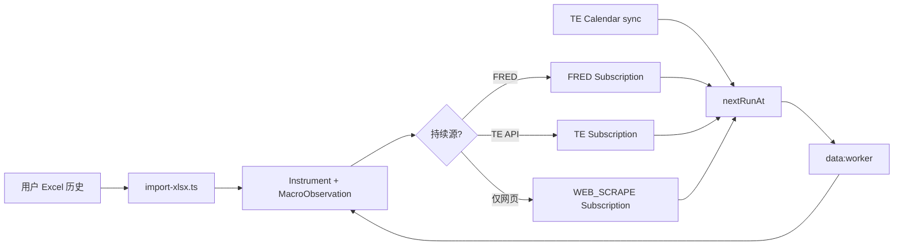

# Prompt：宏观数据目录与自动调度 — 免费多源、TradingEconomics 日历、Excel 与网页抓取

---

## 任务目标

以 **金融网站后台数据工程师** 视角，在本仓库 **finance-site** 内建立 **完整的宏观指标数据库与自动更新流水线**。每条指标在管理页 `/admin/data-catalog` 须能展示并维护：


| #   | 字段         | 说明                                                          |
| --- | ---------- | ----------------------------------------------------------- |
| 1   | **指标归类**   | 国家 → 主题分类（可树形）                                              |
| 2   | **指标名**    | 中文 displayName + 稳定内部 `code`                                |
| 3   | **指标频率**   | 日 / 周 / 月 / 季 / 年                                           |
| 4   | **从哪里获取**  | 发布机构、免费数据源、API/抓取 URL、Excel 来源                              |
| 5   | **当前最新值**  | 数值 + 单位                                                     |
| 6   | **最新更新日期** | 观测所属期 `obsDate`（非 worker 执行时间）                              |
| 7   | **下次更新时间** | **优先 TradingEconomics 经济日历** 匹配的下一发布时刻                      |
| 8   | **到期自动入库** | `nextRunAt ≤ now` → worker 从源拉取 → upsert `MacroObservation` |


**数据源约束**：

- **默认仅使用免费源**：**FRED**（主）、**TradingEconomics**（日历 + 可选序列）；世行开放数据等 **免费 API** 可扩展。
- **禁止** 未经用户确认接入 **付费** API（Bloomberg、Refinitiv 等）。
- **历史难获取**：用户用 **Excel** 一次性导入；Agent 实现/维护 `scripts/import-*-xlsx.ts` 模式。
- **持续更新无免费 API**：Agent 在 **合法、可维护** 前提下编写 **网页抓取脚本**（`WEB_SCRAPE` adapter），定期运行；须记录 selector、样本 URL、ToS 说明。

**禁止**只写文档不改代码；**禁止**把 API Key 写入种子 JSON 或提交 Git；**禁止**跳过有效性检查写入调度。

---

## 第〇部分：与现有实现对齐


| 已有        | 路径                                       | 本 Prompt 要求                     |
| --------- | ---------------------------------------- | ------------------------------- |
| DB schema | `prisma/schema.prisma` → `mds.`*         | **沿用**，按需扩展 enum/metadata       |
| 设计说明      | `docs/DATA_CATALOG_DATABASE.md`          | 实现须符合                           |
| 管理页聚合     | `src/lib/data/scheduler/adminCatalog.ts` | 展示 §一 全部字段                      |
| Worker    | `scripts/data-worker/run-once.ts`        | 到期拉取                            |
| 日历（待替换）   | `investingCalendar/`*                    | **迁移为 TradingEconomics 日历**（§4） |
| Excel 范例  | `scripts/import-us-overview-xlsx.ts`     | 复制模式做新指标                        |
| FRED      | `fredAdapter.ts`                         | 免费主源                            |


---

## 第一部分：免费数据源策略

### 1.1 源优先级（P1→P5）


| 级      | 源                    | 用途                                  | 入库键                        | adapter                  |
| ------ | -------------------- | ----------------------------------- | -------------------------- | ------------------------ |
| **P1** | **FRED**             | 美国/国际宏观序列（BLS/BEA/Fed 转发）           | `fred:{series_id}`         | `FRED_API` ✅ 已有          |
| **P2** | **TradingEconomics** | **经济日历**（nextRunAt）；可选指标 API（免费额度内） | `te:{symbol}` / 日历 eventId | `TRADING_ECONOMICS`（待建）  |
| **P3** | **World Bank 等**     | 跨国年度序列                              | `wb:{cc}:{id}`             | `WORLD_BANK_API` ✅       |
| **P4** | **Excel 导入**         | 历史 bulk、无 API 指标                    | `mds:{code}`               | `BULK_FILE` / 一次性 import |
| **P5** | **网页抓取**             | P4 指标的 **持续更新**                     | `mds:{code}`               | `WEB_SCRAPE`（待建）         |


**决策树**（Agent 为新指标选源）：

```
1. FRED 是否有同口径、免费、仍更新？ → 是 → P1
2. TE 免费 API/页面是否提供同序列？ → 是 → P2（须验证额度与 ToS）
3. 用户是否提供 Excel 历史？ → 是 → P4 导入 + metadata.bootstrap=excel
4. 官网是否可稳定抓取最新值？ → 是 → P5 写 scrape adapter + 探测脚本
5. 以上皆无 → status=TBD，写入 backlog，仍建 Instrument 占位，不启用 scheduler
```

### 1.2 FRED（P1）

- 须 `FRED_API_KEY`（免费注册）。
- 月/季/周/日频规则见 `releaseRule.ts`；**有 TE 日历映射时用 `economic_calendar`**（§4）。
- 验证：API 最新 obs 落在 §0.1 窗口内。

### 1.3 TradingEconomics（P2）

**角色 A — 经济日历（必须实现）**

- **替代** 当前 Investing 日历，作为 `**nextRunAt` 的主来源**。
- 实现 `src/lib/data/scheduler/tradingEconomicsCalendar/`：
  - `client.ts` — 拉取 TE Calendar（**优先** 官方免费 API；若无 Key 则 **HTML/JSON 端点抓取**，遵守限速）
  - `parseHtml.ts` / `types.ts` — 解析 event：国家、标题、重要性、**UTC 发布时间**
  - `teEventMap.ts` — `instrument.code` / `fredSeriesId` / TE symbol → 匹配关键词（类似 `investingEventMap.ts`）
- `data:sync-calendar` **改为** 默认走 TE；Investing 可保留为 `CALENDAR_PROVIDER=investing` 回退（可选）。

**角色 B — 指标数据（可选）**

- 若用户配置 `TRADINGECONOMICS_API_KEY`（免费 tier）：可拉部分 TE 序列作 FRED 补充。
- **须** 在 `metadata` 记录 `teSymbol`、剩余配额策略；超额则 **不调度** 并告警。

**环境变量**（`.env.example` 注释，勿提交值）：

```bash
TRADINGECONOMICS_API_KEY=          # 可选，免费 API
TRADINGECONOMICS_CALENDAR_BASE=     # 可选，覆盖日历 URL
CALENDAR_PROVIDER=tradingeconomics  # 默认 te；investing 回退
```

### 1.4 Excel 历史导入（P4）

**适用**：ISM PMI、内部整理、FRED 无序列、历史仅 xlsx。

**Agent 必须**：

1. 约定 xlsx 列：指标名 | 日期 | 数值 | （可选）单位、来源说明。
2. 脚本 `scripts/import-{scope}-xlsx.ts`：
  - upsert `Instrument`（`code` 稳定，如 `usov_c14`）
  - bulk insert `MacroObservation`
  - 写 `metadata`: `{ "bootstrap": "excel", "sourceFile": "...", "importedAt": "..." }`
3. **不** 自动设 `nextRunAt`；须另建 **P5 抓取** 或 **P2 TE/FRED** 订阅做持续更新。

**已有范例**：`scripts/import-us-overview-xlsx.ts` + `usOverviewLayout.ts`。

### 1.5 网页抓取持续更新（P5）

**适用**：Excel 已导入历史，官网/TE 页面有最新值但 **无免费 API**。

**Agent 必须**：

1. 在 `Instrument.metadata.scrape` 存结构化配置（**不得** 硬编码在 worker 内）：

```json
{
  "scrape": {
    "url": "https://…",
    "method": "GET",
    "selector": "css 或 json path",
    "valueParser": "number",
    "dateParser": "observedAt 或 releaseDate",
    "frequency": "monthly",
    "robotsCheckedAt": "ISO",
    "notes": "ISM 发布页，仅取 headline PMI"
  }
}
```

1. 新建 `src/lib/data/scheduler/adapters/webScrapeAdapter.ts`：
  - 读 config → fetch → 解析 → 返回 `ObservationPoint[]`
  - 超时、重试、User-Agent 可配置
2. `DataSource.adapterKind` 扩展 `**WEB_SCRAPE**`（若 schema 尚无则 migration）。
3. `releaseRule`：与 TE 日历对齐（若该指标在 TE 日历有发布）或 `probe_interval`。
4. 脚本 `npm run data:probe-scrape -- {instrumentCode}` 验证 selector 仍有效。

**合规**：抓取前检查 robots.txt；频率 ≤ 1 次/小时/URL；管理页展示 `scrape.notes`。

---

## 第〇部分（续）：有效性门禁

### 0.1 「有效」定义


| 频度  | 最近观测阈值       |
| --- | ------------ |
| 日   | ≥ 当前日 − 7 天  |
| 周   | ≥ 当前日 − 14 天 |
| 月   | ≥ 当前月 − 3 月  |
| 季   | ≥ 上一完整季度初    |


另：宏观页近 12 月（或等价）非空点足够做 YoY；**禁止** 「有名字无曲线」进默认目录高亮。

### 0.2 验证顺序

```
1. 全量指标台账（seed catalog + fredCatalog + 用户 Excel 清单）
2. FRED/TE API/抓取 各跑探测，记录最新 obs
3. Excel 导入后查 MacroObservation max(obs_date)
4. TE 日历：sync-calendar 对每条订阅写入 calendarMatch + nextRunAt
5. data:worker 试跑 --force
6. data:verify-catalog -- --db（待建）
7. 汇报：有效表 / TBD 表 / 源类型分布
```

---

## 第二部分：数据库模型（须实现字段）

> 表结构见 `docs/DATA_CATALOG_DATABASE.md`；以下为 **业务必填**。

### 2.1 指标归类

- `MacroCategory`（树）+ catalog `country` + `categoryName`
- seed 时 `Instrument.categoryId` 与 catalog 一致

### 2.2 指标主档 `Instrument`


| 字段                    | 用途                                             |
| --------------------- | ---------------------------------------------- |
| `code`                | 全局唯一，如 `sched_fred_CPIAUCSL`、`mds_ism_mfg_pmi` |
| `name`                | 中文指标名                                          |
| `freqLabel`           | 展示频率                                           |
| `unit`                | 单位                                             |
| `metadata.catalogKey` | `fred:*` / `mds:*` / `te:*`                    |
| `metadata.scrape`     | P5 配置                                          |
| `metadata.bootstrap`  | `excel` / `fred` / `te`                        |


### 2.3 订阅 `DataSubscription`


| 字段                        | 用途                                                |
| ------------------------- | ------------------------------------------------- |
| `sourceId` → `DataSource` | FRED / TE / SCRAPE / FILE                         |
| `sourceSeriesKey`         | FRED id 或 TE symbol 或 scrape code                 |
| `granularity`             | 调度粒度                                              |
| `releaseRule`             | 见 §4；含 `**calendarProvider: "tradingeconomics"`** |
| `nextRunAt`               | worker 到期时间                                       |
| `lastObsDate`             | 最新观测期                                             |


### 2.4 观测 `MacroObservation`

- `(instrumentId, obsDate)` 唯一；存 **水平值**；YoY 在图表层。

### 2.5 管理页展示（`AdminCatalogIndicator` 扩展）

在现有字段基础上 **必须展示**：


| 展示项          | 来源                                                                                |
| ------------ | --------------------------------------------------------------------------------- |
| 归类 / 名称 / 频率 | catalog + Instrument                                                              |
| 数据源          | `sourceName` + `acquisition`：`fred` / `tradingeconomics` / `excel` / `web_scrape` |
| 最新值 / 最新观测日  | MacroObservation                                                                  |
| 下次更新         | `nextRunAt`                                                                       |
| TE 日历事件      | `calendarReleaseAt`、`calendarEventTitle`、`calendarProvider`                       |
| 抓取状态         | `scrape.lastOkAt` / `scrape.lastError`                                            |


---

## 第三部分：TradingEconomics 日历 → nextRunAt

### 3.1 `releaseRule` 扩展（JSON）

在现有 `economic_calendar` 上增加：

```typescript
{
  type: "economic_calendar",
  calendarProvider: "tradingeconomics",  // 默认；"investing" 仅回退
  postReleaseProbeHours: 2,
  releaseDelayMinutes: 5,
  calendarMatch?: {
    eventId: string,
    title: string,
    releaseAt: string,      // ISO UTC
    syncedAt: string,
    source: "tradingeconomics"
  },
  calendarSync?: { status, message, syncedAt },
  fallback?: { type: "probe_interval", intervalHours: 12 }
}
```

### 3.2 同步流程

```
data:sync-calendar
  → tradingEconomicsCalendar/client.fetchCalendar(window)
  → teEventMap.match(subscription) → calendarMatch
  → nextRunAt = releaseAt + releaseDelayMinutes
  → 写回 DataSubscription.releaseRule + nextRunAt
```

### 3.3 映射表 `teEventMap.ts`

每条需日历的订阅至少一条：

```typescript
{
  "CPIAUCSL": {
    countryCodes: ["US"],
    keywords: ["Consumer Price Index", "CPI"],
    teCategory: "inflation"  // 可选
  },
  "mds_ism_mfg_pmi": {
    keywords: ["ISM Manufacturing PMI", "Manufacturing PMI"],
    countryCodes: ["US"]
  }
}
```

支持 `.data/te-calendar-mapping-overrides.json` 管理端覆盖（仿 `calendar-mapping-overrides.json`）。

### 3.4 Worker 到期行为

```
data:worker (每 1–5 分钟)
  → WHERE enabled AND nextRunAt <= now()
  → adapter by source:
       FRED_API      → fredAdapter
       TRADING_ECONOMICS → teAdapter（若有）
       WEB_SCRAPE    → webScrapeAdapter
       BULK_FILE     → 跳过或 re-import 标记 manual
  → upsertMacroObservations
  → 更新 lastObsDate, lastSuccessAt
  → 若未到新 obs：postReleaseProbeHours 后再试
  → 若已到新 obs：sync-calendar 已写入的下一 TE 事件 → 新 nextRunAt
  → FetchRun 日志
```

---

## 第四部分：指标生命周期（Excel + 抓取）




**示例 — ISM 制造业 PMI**（FRED 无免费稳定 ID）：

1. 用户 Excel → `mds_ism_mfg_pmi` + 历史观测
2. `teEventMap` 匹配 TE 日历「ISM Manufacturing PMI」→ `nextRunAt`
3. `webScrapeAdapter` 配置 ISM 或 TE 公开页 → 发布后抓取最新值
4. 管理页：来源 `web_scrape + calendar:tradingeconomics`

---

## 第五部分：Agent 必须交付的工程项

### 5.1 日历迁移（P0）


| 文件                                | 动作                           |
| --------------------------------- | ---------------------------- |
| `tradingEconomicsCalendar/`*      | 新建 TE 日历 client + parser     |
| `teEventMap.ts`                   | TE 关键词映射（迁移自 investing 映射逻辑） |
| `applyCalendarSchedules.ts`       | 支持 `calendarProvider`        |
| `sync-calendar.ts`                | 默认 TE                        |
| `docs/DATA_SCHEDULER_CALENDAR.md` | TE 日历运维说明                    |


### 5.2 抓取与 Excel（P1）


| 文件                                    | 动作                   |
| ------------------------------------- | -------------------- |
| `adapters/webScrapeAdapter.ts`        | 通用抓取 adapter         |
| `scripts/data-worker/probe-scrape.ts` | 验证 selector          |
| `scripts/import-{scope}-xlsx.ts`      | 按用户 Excel 模板         |
| `SourceAdapterKind.WEB_SCRAPE`        | schema migration（若缺） |


### 5.3 目录与验证（P1）


| 文件                                      | 动作                                    |
| --------------------------------------- | ------------------------------------- |
| `catalogSeedRegistry.ts`（待建）            | 全指标台账：归类/名/频/源/status                 |
| `scripts/data-worker/verify-catalog.ts` | §0.1 + TE 日历对齐检查                      |
| `adminCatalog.ts`                       | `acquisition` / `calendarProvider` 字段 |
| `.env.example`                          | TE 相关变量注释                             |


### 5.4 npm scripts（package.json）

```bash
npm run data:sync-calendar          # TE 日历 → nextRunAt
npm run data:worker                 # 到期拉取
npm run data:sync-one -- {code} --force
npm run data:probe-sources
npm run data:probe-scrape -- {code}   # 待建
npm run db:import-*-xlsx            # 按 scope
npm run data:verify-catalog -- --db # 待建
```

---

## 第六部分：运维


| 任务                   | 频率               |
| -------------------- | ---------------- |
| `data:sync-calendar` | 每小时              |
| `data:worker`        | 每 1–5 分钟         |
| `data:probe-scrape`  | 每周或 selector 失败时 |
| Excel 重导             | 仅历史修正，非日常        |


Windows 计划任务见 `docs/DATA_SCHEDULER_PHASE1.md`（命令不变，日历提供方改为 TE）。

---

## 第七部分：验证清单（Agent 完成时勾选）

- [ ] `/admin/data-catalog` 每条指标：归类、名称、频率、来源、最新值、最新观测日、**下次更新（TE 日历）**
- [ ] `CALENDAR_PROVIDER=tradingeconomics` 下 `sync-calendar` 写入 `calendarMatch`
- [ ] FRED 指标 worker 成功后 `MacroObservation` 更新
- [ ] 至少 1 条 **Excel 导入 + WEB_SCRAPE** 端到端范例（可 ISM 试点）
- [ ] 免费源 only；付费源未接入
- [ ] `FetchRun` 可追溯；失败有退避
- [ ] `docs/DATA_CATALOG_DATABASE.md` 与 TE 日历文档已更新
- [ ] 未提交 `.env.local`

---

## 第八部分：禁止事项

- **不要** 用付费数据源替代免费方案而不经用户确认
- **不要** 因 FRED/TE 无序列就 **删除指标台账行**
- **不要** 把 Investing 日历写死为唯一来源（须 TE 默认）
- **不要** 抓取 **违反 ToS / robots** 的站点
- **不要** 在 DB 预存 YoY（图表层计算）
- **不要** 跳过 `nextRunAt` 直接 cron 全量拉（须到期驱动）

---

## 第九部分：技术参考


| 项目          | 路径                                               |
| ----------- | ------------------------------------------------ |
| 本 Prompt    | `.cursor/prompts/data-catalog-scheduler.md`      |
| DB 设计       | `docs/DATA_CATALOG_DATABASE.md`                  |
| Schema      | `prisma/schema.prisma`                           |
| 管理页         | `src/lib/data/scheduler/adminCatalog.ts`         |
| FRED        | `src/lib/data/scheduler/adapters/fredAdapter.ts` |
| 旧日历（回退）     | `src/lib/data/scheduler/investingCalendar/`      |
| Excel 范例    | `scripts/import-us-overview-xlsx.ts`             |
| releaseRule | `src/lib/data/scheduler/releaseRule.ts`          |
| Worker      | `scripts/data-worker/run-once.ts`                |


---

## 使用说明

将 **本 Prompt 全文** 交给 Agent，按顺序执行：

**台账 → FRED/TE/Excel/抓取 分源验证 → TE 日历 sync → worker 入库 → 管理页字段齐全 → 文档与 verify**

用户后续提供 **新 Excel** 时：只跑 import 脚本 + 补 scrape/TE 映射，**无需改分析框架**。  
用户后续指定 **新免费 URL** 时：补 `metadata.scrape` + probe-scrape + subscription。