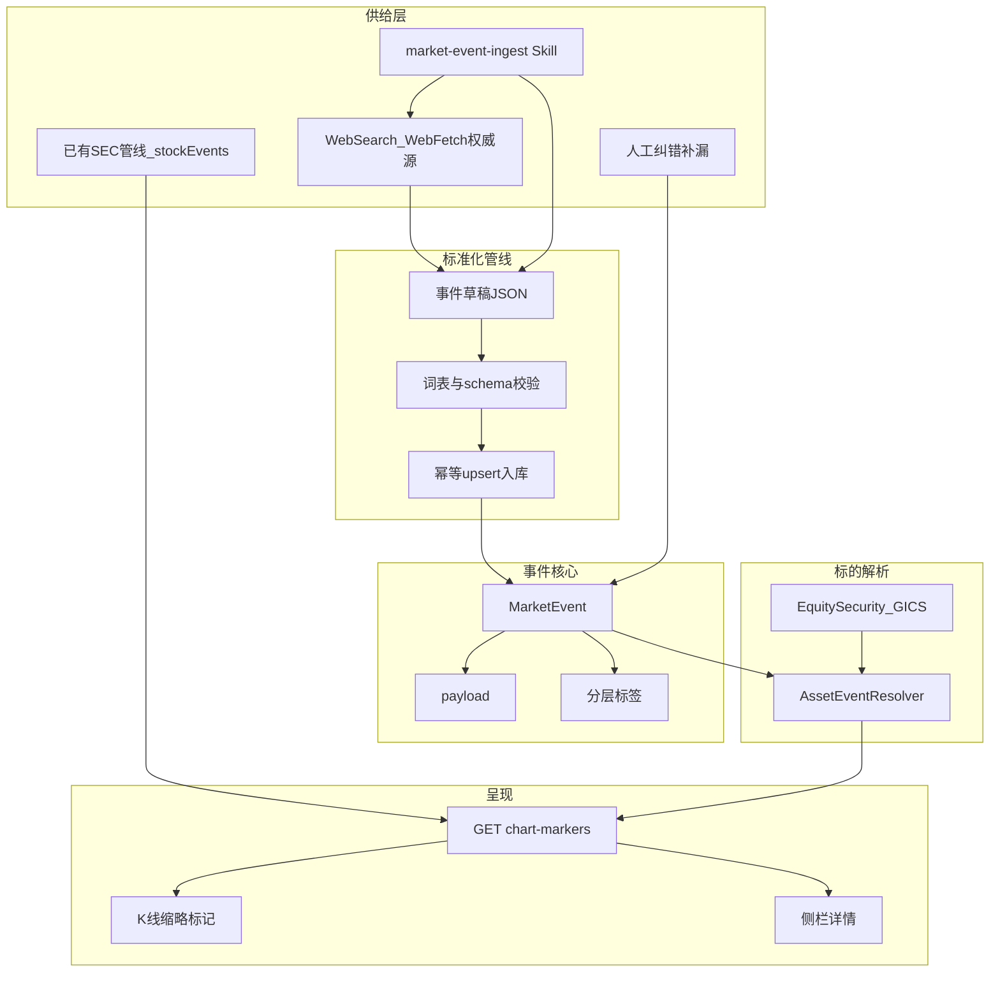

# 事件记录器（K 线联动）设计方案

## 现状与缺口

站内已有基础，**不必从零新建事件库，也不必用 AI 重抓已落库的 SEC 公司事件**：

| 已有 | 缺口 |
|------|------|
| [`MarketEvent`](prisma/schema.prisma)（`countries` / `industries` / `assets` / `macroKeys` + 重要性） | `eventType` 过粗；无「公司新闻 / 讲话 / 评级 / 目标价」结构化字段 |
| [`/api/events`](src/app/api/events) + [`EventChartSidePanel`](src/components/events/EventChartSidePanel.tsx) 与可见区间联动 | **事件不画在 K 线上** |
| **个股基本面 SEC 事件（已落地）** [`stockEvents.ts`](src/lib/equity/stockEvents.ts)：`sec_filing`（10-Q/10-K/8-K）+ `equity_split` + 季度业绩 metrics；API [`/api/equity/stocks/[symbol]/events`](src/app/api/equity/stocks)；UI [`StockEventsPanel`](src/components/equity/StockEventsPanel.tsx) | **仅在个股基本面页**，未进入行情 K 线标记层，也未与 `MarketEvent` 统一 DTO |
| [`.cursor/prompts/market-events-us-history-timeline.md`](.cursor/prompts/market-events-us-history-timeline.md) | 仅覆盖美国历史时代线；**未标准化为可复用 Skill** |
| GICS 在 `EquitySecurity` | 事件行业标签未与 GICS / 标的自动关联 |

设计原则：

1. **公司层结构化事件优先复用 SEC 管线**——财报（earnings/annual）、8-K 关键事项、拆分等 **已从 SEC 获取并落库**，图表标记 **直接读 `stockEvents`，不经 LLM，不写入重复 `MarketEvent`**。
2. **SEC 覆盖不到的类型才走 AI Skill**——政策、宏观/地缘、经营新闻叙事、重要人士讲话、机构评级、目标价，以及非 SEC 公司事项；Skill **禁止**再生成与已有 filing/拆分重复的条目。
3. **统一「图表事件流」适配层**——两侧合成同一 `ChartEventMarker` DTO，供 K 线缩略标记与侧栏消费。

---

## 1. 概念模型（Skill 驱动供给）



**一条事件 = 时间点 + 叙事 + 影响范围标签 + 可选结构化载荷。**  
「关联到标的」：

1. 显式 `assets[]`（Skill 根据检索结果填写；SEC 派生天然绑定当前 symbol）
2. 国家 / GICS 行业标签，查询时由 `AssetEventResolver` 上卷到当前 K 线标的

---

## 1.1 已有个股 SEC 关键事件（一等公民，不重建）

工程基本面已从 SEC 聚合公司关键事件，**本方案直接接入 K 线，不重复造数**：

| 能力 | 位置 | 覆盖 |
|------|------|------|
| 聚合逻辑 | [`src/lib/equity/stockEvents.ts`](src/lib/equity/stockEvents.ts) | `earnings` / `annual` / `8k` / `split` |
| 数据源 | `mds.sec_filing` + `mds.equity_split` + 季度快照 metrics | 10-Q / 10-K / 8-K items + 拆股；库空时懒回补 SEC submissions |
| API | `GET /api/equity/stocks/[symbol]/events?types=...` | 个股时间线 |
| UI | [`StockEventsPanel`](src/components/equity/StockEventsPanel.tsx) | 目前仅基本面页 |

8-K 已按 item 映射中文标签与重要性（如 2.02 业绩、5.02 高管变动、1.01 重大协议等）——标记层 **复用同一套映射** 生成缩略字（「财报」「高管」「并购」等）。

**边界**：

- SEC 已覆盖 → `chart-markers` 的 `source: "stock_derived"`，**默认开启**于公司标的 K 线
- SEC 未覆盖（评级、目标价、讲话、经营新闻解读、国家/行业政策）→ AI Skill → `MarketEvent`
- Skill 的 `company-matter` / `symbol-backfill`：**先查**该 symbol 已有 `stockEvents` 日期+类型，命中则 **跳过**，写入 `skipped[]`（原因：`covered_by_sec`）

---

## 2. 标准 Skill：`market-event-ingest`（补 SEC 之外的供给）

路径：项目级 [`.cursor/skills/market-event-ingest/SKILL.md`](.cursor/skills/market-event-ingest/SKILL.md)（团队共享，非个人 skill）。

现有美国历史 prompt 降级为 Skill 的一个 **mode 参考**（`era-timeline`），统一进同一套输出 schema，避免多套格式。

### 2.1 触发场景（description 写清，便于 Agent 自动选用）

用户或 Agent 在以下意图时必须加载本 Skill：

- 「为某国/某行业/某股票补事件」「同步评级与目标价」「录入 FOMC/政策节点」
- 「生成某标的 K 线事件」「批量补 2020–2026 公司大事」
- 维护 `/events` 或行情标记数据时

### 2.2 Mode 路由（一类事件一个检索策略）

| Mode | 覆盖类型 | 检索重点（须交叉验证 ≥2 源） | 默认 scope |
|------|----------|------------------------------|------------|
| `policy` | 财政/货币/监管/贸易政策 | 官方公报、央行、国会/财政部、主流财经 | COUNTRY / INDUSTRY |
| `macro-event` | 地缘、危机、灾害、市场异动 | 官方+权威媒体时间线 | COUNTRY / CROSS |
| `company-matter` | SEC **未覆盖**的公司事项（如未披露的回购进展叙事）；**不**重抓 10-Q/10-K/8-K/拆分 | IR / 交易所；先对账 stockEvents | COMPANY |
| `ops-news` | 经营新闻、产能、大客户、诉讼叙事 | IR / 可信财经，排除传闻 | COMPANY |
| `speech` | 官员/高管/重要投资人讲话 | 官方稿、听证实录、公司活动 | 视主体 |
| `rating` | 机构评级变动 | 券商报告摘要、可信汇总页 | COMPANY |
| `price-target` | 目标价调整 | 同上，必须有数字 | COMPANY |
| `era-timeline` | 长周期时代阶段（现有 US 历史） | Wikipedia + 一手立法/联储史料 | COUNTRY |
| `symbol-backfill` | 按 ticker 补 **非 SEC** 事件 | 先拉 stockEvents 做排除集，再并行其它 mode | 混合 |

Skill 内规定：

- **禁止编造**日期、评级、目标价；无可靠来源 → `skipped[]`
- **禁止重复 SEC**：凡可用 `stockEvents` 表达的财报/年报/8-K/拆分，一律不入库 `MarketEvent`

### 2.3 强制输出 schema（与 DB DTO 对齐）

每条事件输出统一 JSON（数组 + run 元数据）：

```ts
type IngestEventDraft = {
  externalId: string;       // 幂等键，Skill 按规则生成
  title: string;
  content: string;          // 中文简述，含因果/影响，勿堆砌链接
  occurredAt: string;       // ISO date 或 datetime
  datePrecision: "DATE" | "DATETIME";
  importance: "LOW" | "MEDIUM" | "HIGH" | "CRITICAL";
  scope: "COUNTRY" | "INDUSTRY" | "COMPANY" | "CROSS";
  eventType: string;        // 点分词表，见 §3.2
  countries: string[];
  industries: string[];     // GICS code
  assets: string[];
  macroKeys?: string[];
  persons?: string[];
  institutions?: string[];
  tags?: string[];
  markerLabel: string;      // ≤4 汉字或短英文
  sourceUrl: string | null;
  payload?: Record<string, unknown>;
  sources: { url: string; note?: string }[]; // 检索依据，入库可只留 sourceUrl
};

type IngestRunOutput = {
  mode: string;
  query: { symbol?: string; country?: string; from?: string; to?: string; ... };
  events: IngestEventDraft[];
  skipped: { reason: string; hint?: string }[];
};
```

`externalId` 约定（Skill 必须遵守）：

| 类型 | 格式 |
|------|------|
| 政策/宏观 | `ai:{mode}:{country|industry}:{yyyy-mm-dd}:{slug}` |
| 公司事项/新闻 | `ai:company:{SYMBOL}:{yyyy-mm-dd}:{slug}` |
| 讲话 | `ai:speech:{person}:{yyyy-mm-dd}:{slug}` |
| 评级 | `ai:rating:{agency}:{SYMBOL}:{yyyy-mm-dd}` |
| 目标价 | `ai:pt:{agency}:{SYMBOL}:{yyyy-mm-dd}` |
| 时代阶段 | 沿用现有 `seedKey` 规则 |

### 2.4 Skill 目录结构

```
.cursor/skills/market-event-ingest/
├── SKILL.md                 # 触发、mode 路由、禁编造、入库步骤
├── reference/
│   ├── event-taxonomy.md    # 与代码词表同步的类型/缩略字/重要性启发式
│   ├── source-whitelist.md  # 优先源（Fed/SEC/公司 IR/FRED/Wikipedia…）
│   └── gics-alias.md        # 中文行业 ↔ GICS code
├── templates/
│   └── ingest-output.schema.json
└── scripts/                 # 可选：校验 + 调用 import
    └── validate-ingest.mjs
```

与代码共用词表：Skill `reference/event-taxonomy.md` 由 [`marketEvents.ts`](src/lib/data/marketEvents.ts) 的常量生成或双向保持同步（实现时以 TS 为单一事实来源，Skill 文档引用「以 marketEvents.ts 为准」）。

### 2.5 入库步骤（Skill 执行清单）

1. 解析用户意图 → 选 mode（可多 mode）
2. WebSearch / WebFetch 检索，交叉验证
3. 生成 `IngestRunOutput` JSON
4. 跑 `scripts/validate-ingest`（或 `npm run events:validate-ingest -- file.json`）
5. 幂等 upsert：`npm run events:import-ingest -- file.json`（扩展现有 [`marketEventsImport`](src/lib/data/marketEventsImport.ts)）
6. 向用户回报：写入 N 条 / 跳过 M 条 / 失败原因

`sourceKind` 入库统一为 `ai_skill`。

### 2.6 与现有 prompt 的关系

- [`.cursor/prompts/market-events-us-history-timeline.md`](.cursor/prompts/market-events-us-history-timeline.md) → Skill mode `era-timeline` 的详细规程；prompt 文件可保留为长文参考，**入口改为 Skill**。
- 宏观维度流水线（`.cursor/prompts/macro-dimension-pipeline.md`）不替代本 Skill；本 Skill 只产「人文/市场事件」，不产 FRED 订阅。

---

## 3. 标签与类型体系（过滤 + Skill 共用）

### 3.1 影响范围 `scope`

| scope | 含义 | 典型关联 |
|-------|------|----------|
| `COUNTRY` | 国家/地区政策与宏观事件 | `countries` |
| `INDUSTRY` | 行业政策、供需、监管 | `industries`（GICS）± `countries` |
| `COMPANY` | 公司事项、经营新闻、评级 | `assets` 必填 |
| `CROSS` | 跨市场异动、多标的叙事 | 多 `assets` / 多国 |

### 3.2 事件类型 `eventType`（点分受控词表）

```
policy.fiscal | policy.monetary | policy.regulatory | policy.trade
macro.release | macro.geopolitics | macro.disaster
company.earnings | company.guidance | company.corp_action
company.filing | company.ops_news | company.management
speech.official | speech.executive | speech.investor
rating.initiate | rating.upgrade | rating.downgrade | rating.maintain
price_target.change
market.anomaly | other
```

### 3.3 维度标签

| 维度 | 存储 | 规范 |
|------|------|------|
| 国家 | `countries[]` | `MACRO_COUNTRIES` |
| 行业 | `industries[]` | GICS code；旧中文作 alias |
| 标的 | `assets[]` | Yahoo ticker 大写 |
| 宏观键 | `macroKeys[]` | `fred:` / `mds:` |
| 人物 | `persons[]` | Skill 从讲话/政策主体抽取 |
| 机构 | `institutions[]` | Fed、券商、监管机构等 |
| 自由标签 | `tags[]` | 主题词 |
| 重要性 | `importance` | Skill 按启发式打标，人工可改 |

---

## 4. 数据模型扩展

在 `public.MarketEvent` 上增量：

```prisma
scope         EventScope   @default(CROSS)
persons       String[]     @default([])
institutions  String[]     @default([])
tags          String[]     @default([])
payload       Json?
markerLabel   String?      @db.VarChar(16)
sourceKind    String?      @db.VarChar(32)  // ai_skill|manual|sec|import
externalId    String?      @db.VarChar(128)
```

`(sourceKind, externalId)` 唯一约束，支撑 Skill 重复跑幂等。

### `payload`（Skill 必填对应字段）

```ts
// rating.* / price_target.change
{ agency, action?, from?, to?, targetPrice?, prevTarget?, currency?, symbol }

// speech.*
{ speaker, org?, venue? }

// company.earnings（若 Skill 补叙事；数字也可来自 SEC 派生）
{ symbol, period?, epsActual?, epsEstimate? }
```

---

## 5. 标的关联：`AssetEventResolver`

输入当前 K 线 `symbol`，展开：

```ts
{
  assets: ["AAPL"],
  industries: ["45", "4520"],
  countries: ["US"],
  expand: "symbol" | "industry" | "country"
}
```

命中：直接 assets →（可选）GICS 前缀 →（可选）国家。Skill 写入时即应填好正确 `scope` 与标签，解析器负责「看图时的上卷」，不负责猜事件内容。

---

## 6. K 线缩略标记

### 6.1 API

`GET /api/events/chart-markers?symbol=&from=&to=&expand=&types=&minImportance=`

**双源合并（顺序固定）**：

1. **`stockEvents(symbol)`**（已有 SEC 管线）→ `source: "stock_derived"`，映射 `eventType`：`company.earnings` / `company.filing` / `company.corp_action` 等；缩略字来自现有中文 title/item 表
2. **`MarketEvent`**（AI Skill / 人工，经 `AssetEventResolver` 过滤）→ `source: "market_event"`

同一日去重：若 Skill 误写入与 SEC 同日同类，标记层以 `stock_derived` 为准并隐藏重复。

### 6.2 渲染

[`StockChartWorkspace`](src/components/StockChartWorkspace.tsx) 使用 Lightweight Charts `createSeriesMarkers`；可见区间防抖拉取；点击开详情。

图层开关：类型组、最低重要性、上卷级别、缩略样式（localStorage → 后续用户偏好）。

同日多事件聚合为 `+N`。

---

## 7. 录入与接入优先级（修订）

| 优先级 | 来源 | 方式 | sourceKind / source |
|--------|------|------|---------------------|
| **P0 已有** | **SEC 个股关键事件**（基本面已落地） | 继续用 `stockEvents`；进 `chart-markers`，**不**再 ETL 进 MarketEvent | `stock_derived` |
| **P0 补齐** | **AI Skill**（政策/讲话/评级/目标价/经营新闻等） | mode 检索 → JSON → validate → upsert | `ai_skill` |
| P1 | 人工 | 表单纠错/补漏 | `manual` |
| P2 可选 | 宏观 ReleasePackage 发布日 | 配置生成 marker | `import` |

**不做**：用 Skill/爬虫重抓已由 SEC sync 覆盖的 10-Q/10-K/8-K/拆分。  
Skill 批跑只补 **SEC 空白类型**；公司结构化事件继续依赖现有 `equity:sync` / SEC 懒回补。

---

## 8. 模块边界

- 事件仍在 `public.MarketEvent`，不进 `mds` 目录
- Skill 产出人文/市场事件；宏观数据订阅仍走 scheduler
- 标记层优先行情 K 线；宏观页继续侧栏

---

## 9. 分期落地（修订）

**P0 — SEC 上图 + Skill 补空白 + 能画在图上**

1. 扩展 schema + 词表（TS 单一事实来源）
2. **`chart-markers` 首先接入已有 `stockEvents`**（验证 AAPL 等标的财报/8-K/拆分已出现在日线）
3. **编写 `market-event-ingest` Skill**（含「对账 stockEvents、禁止重复 SEC」条款）
4. `events:validate-ingest` / `events:import-ingest` 幂等管线
5. `AssetEventResolver` + MarketEvent 合并进同一 markers API
6. SeriesMarkers + 图层开关（**SEC 公司事件**独立开关，默认开）+ 点击联动
7. Skill 样例：`policy` 一条 + `rating`/`speech` 一条（**不**要求 Skill 产出财报）

**P1 — 类型与关联打磨**

1. GICS 规范化 + alias
2. `rating` / `price-target` / `speech` mode 完善
3. 同日聚合、上卷 UX；表单仅保留纠错能力

**P2 — 批量化运维**

1. 按国家/行业批跑 Skill 的操作文档（`docs/MARKET_EVENT_RECORDER.md`）
2. 用户级标记偏好云同步
3. 可选：ReleasePackage 发布日标记

---

## 10. 成功标准

- 打开已有 SEC 数据的个股日线（如同步过 filings 的标的），**不跑 Skill** 也能看到财报/8-K/拆分缩略标记（与 `StockEventsPanel` 同源）
- Agent 加载 Skill 后，能为指定 symbol/国家补 **非 SEC** 事件并幂等入库；对已有 SEC 事件写入 `skipped: covered_by_sec`
- 勾选类型过滤后标记正确；点击可见详情（SEC 链到 filing URL，Skill 链到 sourceUrl）
- `expand=country` 时国家政策可见，`expand=symbol` 时不刷屏
- 无编造评级/目标价；现有基本面 `StockEventsPanel` 行为不被破坏；构建通过

---

## 关键改动文件（实现时）

- **新** [`.cursor/skills/market-event-ingest/`](.cursor/skills/market-event-ingest/) — 标准检索生成 Skill
- [`prisma/schema.prisma`](prisma/schema.prisma) + migration
- [`src/lib/data/marketEvents.ts`](src/lib/data/marketEvents.ts) — 词表、DTO
- [`src/lib/data/marketEventsImport.ts`](src/lib/data/marketEventsImport.ts) — ingest upsert
- 新：`assetEventResolver.ts`、`chartEventMarkers.ts`、`api/events/chart-markers`
- [`StockChartWorkspace.tsx`](src/components/StockChartWorkspace.tsx)、[`MarketsClient.tsx`](src/app/markets/MarketsClient.tsx)
- 轻量 [`EventFormModal`](src/components/events/EventFormModal.tsx) / filters
- 文档：`docs/MARKET_EVENT_RECORDER.md`（含「如何用 Skill 批补事件」）
