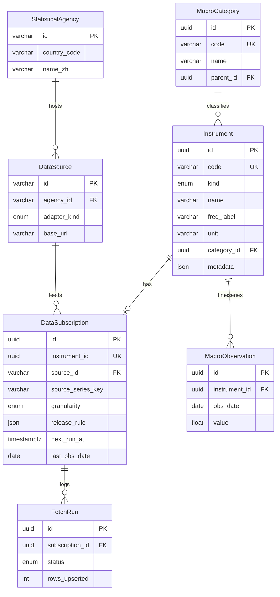

# 数据目录数据库设计 — 指标归类、来源、最新值与日历调度

> 本文档基于当前 **finance-site** 已实现的数据目录（`/admin/data-catalog`）、`mds` schema 与 **data-scheduler** 流水线，定义 **目标信息模型** 与 **表级映射**。  
> 实现代码以 `prisma/schema.prisma`（`mds`）与 `src/lib/data/scheduler/*` 为准；本文档用于 PR、Agent 任务与运维对齐。

---

## 一、业务目标

金融网站后台需要为 **每一条宏观/目录指标** 持久化并展示：

| # | 业务字段 | 说明 |
| --- | --- | --- |
| 1 | **指标归类** | 国家 → 主题分类（可树形） |
| 2 | **指标名** | 用户可见中文名、稳定内部编码 |
| 3 | **指标频率** | 日 / 周 / 月 / 季 / 年 |
| 4 | **从哪里获取** | 发布机构、技术数据源、API、官方页面 |
| 5 | **当前最新值** | 数值 + 单位 |
| 6 | **最新更新日期** | 该指标在库内 **观测日期**（非拉取时间） |
| 7 | **下次更新时间** | 优先来自 **经济日历**；无日历则规则探测 |
| 8 | **到期自动拉取入库** | `nextRunAt ≤ now` 时 worker 调源端 adapter → upsert 观测 |

**非目标（本目录不管）**：用户账户、K 线 `Bar`、事件记录器 `MarketEvent`（另 schema）。

---

## 二、逻辑架构（五层）

```
┌─────────────────────────────────────────────────────────────────┐
│ L5 展示层  /admin/data-catalog  ·  宏观页 catalogKey 引用        │
└───────────────────────────────┬─────────────────────────────────┘
                                │ buildAdminDataCatalog() 聚合
┌───────────────────────────────▼─────────────────────────────────┐
│ L4 目录层  fredCatalog.ts / unifiedMacro  ·  label/frequency/key │
└───────────────────────────────┬─────────────────────────────────┘
                                │ key ↔ Instrument
┌───────────────────────────────▼─────────────────────────────────┐
│ L3 指标层  Instrument  ·  名称/单位/分类/外部引用 metadata        │
└───────────────────────────────┬─────────────────────────────────┘
                                │ 1:1
┌───────────────────────────────▼─────────────────────────────────┐
│ L2 订阅层  DataSubscription  ·  源序列键/releaseRule/nextRunAt   │
└───────────────────────────────┬─────────────────────────────────┘
                                │ N:1          │ 1:N
┌───────────────────────────────▼──────────────▼──────────────────┐
│ L1 基础设施  DataSource · StatisticalAgency  ·  FetchRun 日志      │
└───────────────────────────────┬─────────────────────────────────┘
                                │ upsert
┌───────────────────────────────▼─────────────────────────────────┐
│ L0 观测层  MacroObservation(instrumentId, obsDate, value)        │
└─────────────────────────────────────────────────────────────────┘
```

**原则**：

- **目录（L4）** 可大于 **已入库（L3）**：catalog 列出全部候选指标；`inDatabase=false` 表示尚未 seed。
- **最新值（L0）** 与 **调度状态（L2）** 分离：值来自观测表；`nextRunAt` 来自订阅 + 日历。
- **多源**：同一 `Instrument` 仅一条 `DataSubscription`；adapter 由 `DataSource.adapterKind` 决定（FRED / 世行 / xlsx / 复合等）。

---

## 三、业务字段 → 数据库映射

| 业务字段 | 主存储 | 管理页字段 (`AdminCatalogIndicator`) | 备注 |
| --- | --- | --- | --- |
| 指标归类 | `MacroCategory` + catalog `categoryName` | `countryCode` + `categoryName` | 国家来自 catalog 顶层 |
| 指标名 | `Instrument.name` + catalog `label` | `label` | UI 优先 catalog label |
| 内部编码 | `Instrument.code` | `instrumentCode` | 如 `sched_fred_CPIAUCSL`、`usov_c16` |
| 目录键 | — | `key` | `fred:{ID}` / `mds:{code}` / `wb:{cc}:{id}` |
| 频率 | `Instrument.freqLabel` + `DataSubscription.granularity` | `frequency` | 展示用中文频度；调度用 enum |
| 发布机构 | `StatisticalAgency` | `agencyName` / `agencyWebsiteUrl` | 如 BLS、BEA |
| 技术数据源 | `DataSource` | `sourceName` / `apiSourceUrl` | 如 FRED API |
| 官方/序列页 | `metadata.sourceUrl` | `sourcePageUrl` | FRED 系列页等 |
| Excel/备注来源 | `Instrument.metadata.source` | `dbSource` | xlsx 第 6 行等 |
| 获取方式探测 | `metadata.fetchAcquisition` | `fetchAcquisition*` | `data:probe-sources` 写入 |
| 当前最新值 | `MacroObservation` 最新行 | `latestValue` + `unit` | SQL `DISTINCT ON` 聚合 |
| 最新观测日期 | `MacroObservation.obsDate` 或 `DataSubscription.lastObsDate` | `latestObsDate` | **数据所属期**，非 worker 时间 |
| 下次运行时间 | `DataSubscription.nextRunAt` | `nextRunAt` | worker 到期判断 |
| 日历下一发布 | `releaseRule.calendarMatch.releaseAt` | `calendarReleaseAt` | sync-calendar 写入 |
| 日历事件标题 | `releaseRule.calendarMatch.title` | `calendarEventTitle` | |
| 日历同步状态 | `releaseRule.calendarSync.status` | `calendarSyncStatus` | matched / no_match / … |
| 更新计划摘要 | `releaseRule` 解析 | `releaseRuleSummary` | 人类可读 |
| 最近拉取 | `FetchRun` | `lastFetch*` | 审计 |

---

## 四、ER 关系（`mds` schema）



**唯一约束**：`(instrumentId, obsDate)` 保证同一指标同一观测日一条记录，支持修订 upsert。

---

## 五、核心表说明

### 5.1 `MacroCategory` — 指标归类（库内树）

| 字段 | 用途 |
| --- | --- |
| `code` | 稳定编码，如 `price_index`、`employment` |
| `name` | 分类中文名 |
| `parentId` | 可选多级树 |
| `sortOrder` | 管理页排序 |

**与目录关系**：宏观 UI 侧栏分类来自 `fredCatalog.ts` 的 `categoryName`（按国家分组）；seed 时可将 Instrument 挂到 `MacroCategory`。两者应 **语义一致**，code 可映射（见 `usOverviewLayout` 的 `US_OVERVIEW_CATEGORY_CODE_BY_NAME`）。

### 5.2 `Instrument` — 指标主档

| 字段 | 用途 |
| --- | --- |
| `code` | 全局唯一，调度与 API 引用 |
| `kind` | `MACRO_SERIES`（本目录主体） |
| `name` / `shortName` | 中文/短名 |
| `freqLabel` | 展示频率（月、日…） |
| `unit` | Index、Percent、USD/Barrel… |
| `fredSeriesId` | 可选，便于 FRED 反查 |
| `metadata` | `countryCode`、`source`、`fetchAcquisition`、`catalogKey` 等 JSON |

**catalogKey 约定**（与宏观页一致）：

| 前缀 | 示例 | 含义 |
| --- | --- | --- |
| `fred:` | `fred:CPIAUCSL` | FRED 序列 |
| `mds:` | `mds:usov_c16` | 本地 mds / xlsx 导入 |
| `wb:` | `wb:US:NY.GDP.MKTP.KD.ZG` | 世界银行 |

### 5.3 `StatisticalAgency` + `DataSource` — 「从哪里获取」

| 层级 | 回答 |
| --- | --- |
| **Agency** | 谁发布（BLS、BEA、Fed、BIS…） |
| **Source** | 用什么技术拉（`FRED_API`、`WORLD_BANK_API`、`BULK_FILE`…） |

`DataSource.adapterKind` 决定 worker 调用哪个 adapter：

| adapterKind | 实现路径 |
| --- | --- |
| `FRED_API` | `fredAdapter.ts` / `fredComposite.ts` |
| `WORLD_BANK_API` | `worldbankAdapter.ts` |
| `BULK_FILE` | `overviewXlsxAdapter.ts`（Overview xlsx） |
| `REST_API` | 预留（BEA/BLS 直连等） |
| `MANUAL` | 仅手工导入，不自动拉 |

### 5.4 `DataSubscription` — 调度与「下次更新」

一条 Instrument **最多一条** 订阅。

| 字段 | 用途 |
| --- | --- |
| `sourceSeriesKey` | 源内 ID（如 FRED `CPIAUCSL`） |
| `granularity` | `DAILY` / `WEEKLY` / `MONTHLY` / `QUARTERLY` / … |
| `releaseRule` | JSON，见 §6 |
| `nextRunAt` | **worker 到期时间**（由日历或规则计算） |
| `lastSuccessAt` | 最近一次成功拉取完成时间 |
| `lastObsDate` | 源端/库内已确认的最新 **观测期** |
| `revisionLookback` | 增量拉取向前覆盖月数（宏观修订） |
| `enabled` | 是否参与 worker |

### 5.5 `MacroObservation` — 最新值

| 字段 | 用途 |
| --- | --- |
| `obsDate` | 指标 **所属日期**（月频多为月初） |
| `value` | 原始水平值（YoY 等在图表层计算） |

管理页 **当前最新值** = 该 `instrumentId` 下 `obsDate` 最大行的 `value`。

### 5.6 `FetchRun` — 拉取审计

每次 `runDataSubscription` 写一条：成功/失败、upsert 行数、滞后天数，供管理页「最近拉取」与排障。

---

## 六、发布规则 `releaseRule` 与「下次更新时间」

存储于 `DataSubscription.releaseRule`（JSON），类型见 `releaseRule.ts`。

| type | 适用 | nextRunAt 如何来 |
| --- | --- | --- |
| **`economic_calendar`** | CPI、NFP、失业率等 **有 Investing 日历** 的月/季宏观 | `data:sync-calendar` 匹配事件 → 写入 `calendarMatch.releaseAt` → `nextRunAt = releaseAt + releaseDelayMinutes`；过期后按 `postReleaseProbeHours` 重试 |
| **`calendar_monthly`** | 无精确日历但月内窗口 | 每月 `probeFromDay`–`probeUntilDay` 内间隔探测 |
| **`probe_interval`** | 日频国债、VIX、T10Y2Y 等 | 固定 N 小时探测 |
| **`manual`** | xlsx 手工维护 | `nextRunAt` 不自动推进（除非 force） |

**经济日历链路**：

```
Investing 经济日历 HTML/API
    → fetchInvestingEconomicCalendar()
    → investingEventMap.ts（FRED ID / instrument code → 关键词）
    → calendarMappingStore.ts（.data 覆盖）
    → applyCalendarSchedules.ts
    → 更新 releaseRule.calendarMatch + DataSubscription.nextRunAt
```

**403 / 无匹配**：`calendarSync.status = fetch_failed | no_match`，回退 `releaseRule.fallback`（通常 `probe_interval`），worker **仍会** 按回退规则运行。

---

## 七、自动拉取入库闭环

```
┌──────────────────┐     每小时（建议）      ┌─────────────────────┐
│ data:sync-calendar│ ──────────────────────► │ nextRunAt 刷新       │
└──────────────────┘                         │ calendarMatch 快照   │
                                               └──────────┬──────────┘
                                                          │
┌──────────────────┐     每 1–5 分钟（建议）               │
│ data:worker      │ ◄─────────────────────────────────────┘
│ run-once.ts      │
└────────┬─────────┘
         │ WHERE enabled AND nextRunAt <= now()
         ▼
┌──────────────────┐
│ runDataSubscription │
│  → adapter 拉增量   │
│  → upsertMacroObservations │
│  → 更新 lastObsDate / lastSuccessAt │
│  → computeNextRunAt / scheduleAfterSuccessfulFetch │
│  → FetchRun 日志    │
└──────────────────┘
```

**单条强制执行**：`npm run data:sync-one -- sched_fred_CPIAUCSL --force`

**成功后**：若抓到新 `obsDate`，按规则推进 `nextRunAt`（日历事件则指向下一次发布或 post-release 探测）。

**失败后**：指数退避 `computeBackoffRunAt(retryCount)`，写 `lastError`。

---

## 八、管理页数据目录如何组装

API：`GET /api/admin/data-catalog` → `buildAdminDataCatalog()`（`adminCatalog.ts`）。

**步骤**：

1. 读 **全量目录** `getFredCatalogCached()`（国家 → 分类 → `UnifiedCatalogItem`）。
2. 读 DB 全部 `Instrument`（`MACRO_SERIES`）+ `DataSubscription` + `Source` + `Agency`。
3. `catalogKey` 解析到 Instrument（`fred:` → `fredSeriesId` / `sched_fred_*`；`mds:` → `code`）。
4. SQL 聚合最新 `MacroObservation`、最新 `FetchRun`。
5. 合并为 `AdminCatalogIndicator` 行。

因此：**目录是 superset**；统计卡片 `inDatabase` / `withSubscription` / `withLatestValue` 反映落地进度。

---

## 九、指标入库与 seed 规范

### 9.1 新指标最小集合

新增一条可调度指标，DB 需有：

1. `Instrument`（name、unit、freqLabel、categoryId/metadata）
2. `DataSubscription`（sourceId、sourceSeriesKey、granularity、releaseRule、enabled=true）
3. （可选）初始 `MacroObservation` 历史 — 由首次 worker 或 seed 脚本拉取

### 9.2 种子脚本模式

| 场景 | 脚本 / catalog |
| --- | --- |
| P0 试点 FRED | `data:seed-p0` / `p0SeedCatalog.ts` |
| CPI 全量 | `data:seed-cpi` / `cpiFredSeedCatalog.ts` |
| Phase2–5 扩展 | `phase*SeedCatalog.ts` |
| Overview xlsx | `npm run db:import-us-overview-xlsx` → Instrument + Observation |
| 日历映射 | `investingEventMap.ts` + 管理端覆盖 API |

### 9.3 `metadata.fetchAcquisition`

`data:probe-sources` 探测后写入，供管理页展示 **API / 文件 / 待确认**；不影响 `nextRunAt`，但指导 adapter 开发。

---

## 十、与宏观前端的关系

| 前端 | 使用 |
| --- | --- |
| 宏观页指标树 | `fredCatalog` + DB 观测；key = `catalogKey` |
| 图表 | `GET /api/data/macro` 读 `MacroObservation` |
| 模板 | `macroPresetTemplates` 引用 catalogKey |

**数据目录是「元数据 + 调度」真相源**；图表不直接读 `DataSubscription`，只读观测。

---

## 十一、当前缺口与演进（设计预留）

| 缺口 | 现状 | 建议 |
| --- | --- | --- |
| 目录与 `MacroCategory` 双轨 | catalog 静态 TS + DB 分类可能不一致 | seed 时强制 `categoryId`；catalog 与 DB 同 PR |
| 最新值实时性 | 管理页每次 SQL 聚合 | 可选：`InstrumentSnapshot` 物化表（`latest_value`, `latest_obs_date`）在 worker 成功后更新 |
| 非 FRED 源 | FMP/BEA 直连部分 TBD | 新 `DataSource` + adapter；`REST_API` |
| 日历单点 | Investing + cookie | 备选：Fed/BLS 官方 release calendar ICS |
| mds 无订阅 | 仅 xlsx 导入、无 `DataSubscription` | Overview 经济列应补 subscription 或标 `manual` + 定期 re-import |

**Schema 变更原则**：同一时刻仅一人改 `prisma/migrations`；新增表优先扩展 `mds`，不污染 `public`。

---

## 十二、运维命令速查

| 命令 | 作用 |
| --- | --- |
| `npm run db:migrate` | 应用 schema |
| `npm run db:import-us-overview-xlsx` | xlsx → mds 观测 |
| `npm run data:seed-p0` / `data:seed-cpi` / … | 写入 Instrument + Subscription |
| `npm run data:sync-calendar` | 经济日历 → `nextRunAt` |
| `npm run data:worker` | 到期拉取入库 |
| `npm run data:sync-one -- {code} --force` | 单条测试 |
| `npm run data:probe-sources` | 探测获取方式 → metadata |
| `npm run data:verify-phase1` … `verify-phase5` | 分阶段自检 |

Windows 计划任务示例见 `docs/DATA_SCHEDULER_PHASE1.md`。

环境变量：`DATABASE_URL`、`FRED_API_KEY`、`INVESTING_CALENDAR_COOKIE`（日历 403）。

---

## 十三、Agent / 开发检查清单

实现或扩展数据目录时：

- [ ] 每条新指标在 **目录** 有 `label` + `frequency` + `categoryName`
- [ ] DB 有 `Instrument` + `DataSubscription`（或明确 `manual`）
- [ ] `releaseRule` 与频度匹配（月频宏观优先 `economic_calendar` + `investingEventMap` 关键词）
- [ ] 跑通 `sync-calendar` → `worker` → `MacroObservation` 有最新行
- [ ] 管理页该行：`latestValue`、`latestObsDate`、`nextRunAt`、`releaseRuleSummary` 非空（或 TBD 说明）
- [ ] `FetchRun` 成功且无持续 `lastError`
- [ ] 密钥仅在 `.env.local`

---

## 十四、相关文件索引

| 主题 | 路径 |
| --- | --- |
| Schema | `prisma/schema.prisma`（`mds.*`） |
| 管理页聚合 | `src/lib/data/scheduler/adminCatalog.ts` |
| 管理页 UI | `src/app/admin/data-catalog/` |
| 发布规则 | `src/lib/data/scheduler/releaseRule.ts` |
| 日历同步 | `src/lib/data/scheduler/applyCalendarSchedules.ts` |
| 日历映射 | `src/lib/data/scheduler/investingEventMap.ts` |
| Worker | `scripts/data-worker/run-once.ts` |
| 统一目录 | `src/lib/data/fredCatalog.ts` |
| Phase1 运维 | `docs/DATA_SCHEDULER_PHASE1.md` |
| CPI 调度 | `docs/DATA_SCHEDULER_CPI.md` |
| AGENTS 总览 | `AGENTS.md` |

---

## 十五、一句话总结

**指标归类与名称** 在 `MacroCategory` + `Instrument` + 统一 catalog；**频率与来源** 在 `Instrument` + `DataSubscription` + `DataSource`/`Agency`；**最新值与观测日期** 在 `MacroObservation`；**下次更新时间** 在 `DataSubscription.nextRunAt`（由 **经济日历** `sync-calendar` 或 **探测规则** 计算）；**到期自动入库** 由 `data:worker` 执行 adapter 拉取并 upsert，全程 `FetchRun` 留痕。
